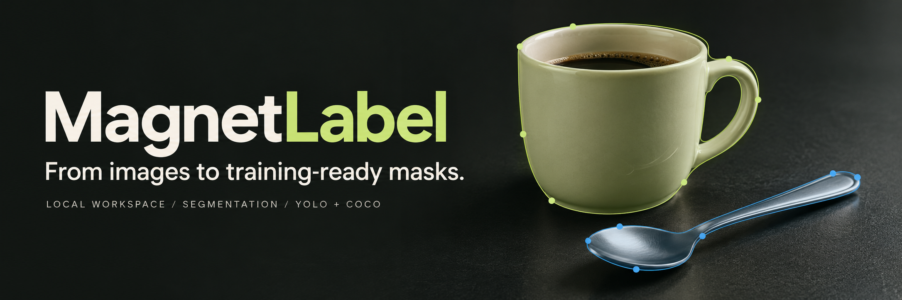
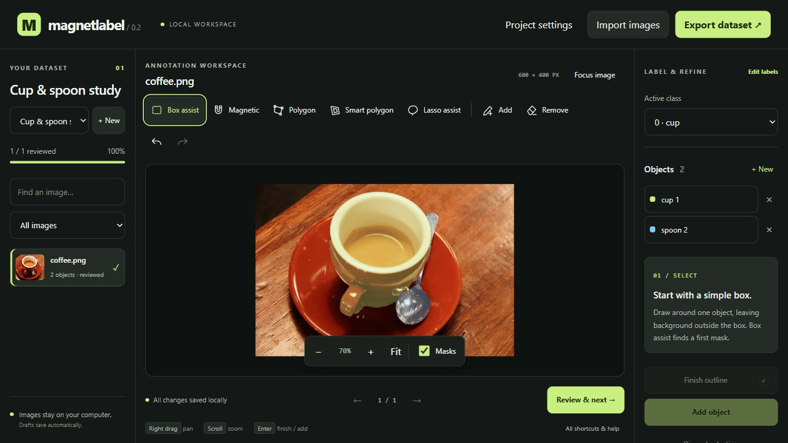

<p align="center"></p>

<p align="center">
  <a href="https://github.com/FarzamFattahi/magnetlabel/actions/workflows/ci.yml"></a>
  
  <a href="LICENSE"></a>
  
</p>

# MagnetLabel

**Outline an object. Refine its mask. Export a dataset you have reviewed.**

MagnetLabel is a focused, local segmentation annotation workspace. Draw a rough box, polygon, or freehand loop and let computer vision estimate the foreground. Follow edges with magnetic anchors when you need more control, correct individual pixels, and label each object before exporting to YOLO segmentation or COCO.

No account, cloud upload, GPU, or model weights. Your browser is the interface; your computer stores the images and masks.

**[Download for Windows](https://github.com/FarzamFattahi/magnetlabel/releases/latest) · [Quick start](#start-in-minutes) · [Annotation guide](#your-first-dataset) · [Export details](#training-ready-exports) · [Validation](docs/validation.md)**



*Actual application screenshot with masks corrected and reviewed by Farzam: cup and spoon are separate labels. This is a human-reviewed example, not benchmark ground truth. The banner above is AI-generated promotional artwork.*

## Start in minutes

### Windows — no Python installation needed

1. Download **MagnetLabel-0.2.0-windows-x64.zip** from the [latest release](https://github.com/FarzamFattahi/magnetlabel/releases/latest).
2. Extract the **entire ZIP**. Double-click `MagnetLabel.exe` inside the extracted folder.
3. Your browser opens the workspace. Keep the terminal open while labeling; press **Ctrl+C** there to stop.

The portable package is unsigned, so Windows may show a publisher warning. Source installation is also available below.

### Source — Windows, Linux, macOS

[Download the source ZIP](https://github.com/FarzamFattahi/magnetlabel/archive/refs/heads/main.zip) and extract it, or clone the repository:

```bash
git clone https://github.com/FarzamFattahi/magnetlabel.git
cd magnetlabel
```

Install **Python 3.11 or newer**, then:

| System | Launch |
| --- | --- |
| Windows | Double-click **start.cmd** |
| Linux / macOS | Run **sh start.sh** |

The launcher creates a virtual environment and installs dependencies on first use. This first setup needs internet access; labeling works offline afterward. No Node.js or frontend build is required. Windows/Edge and the portable Windows package are tested locally. Linux is covered by CI; macOS has not been tested locally.

If you prefer to manage the environment yourself:

```bash
python -m venv .venv
# Windows: .venv\Scripts\python.exe -m pip install .
.venv/bin/python -m pip install .
.venv/bin/python -m magnetlabel.cli
```

The local address is **http://127.0.0.1:8765**. All datasets live in **`~/.magnetlabel`** by default (`%USERPROFILE%\.magnetlabel` on Windows). To use another workspace or port:

```bash
magnetlabel --data /path/to/workspace --port 8768 --no-browser
```

## Your first dataset

1. Click **Choose your images**. Name the dataset, choose how many labels you need, and name them—for example, `cup` and `spoon`.
2. Import files, choose a folder, or paste a local folder path. Originals stay intact. Try the included [real coffee photograph](examples/coffee.png) to explore the tools.
3. Choose an active class and select one object using a tool below.
4. Inspect the mask. Use **Add / Remove** brushes to correct pixels. Foreground/background hints guide **Tighten / recompute** inside the original selection.
5. Click **Add object**. Each object has its own mask and label. Click **+ New** in the Objects panel for another instance.
6. Check all boundaries and labels, then **Review & next**. A reviewed image with no objects becomes a verified negative example.
7. Export at least **two reviewed images**. Draft images stay out of the training package.

Use **+ New beside the dataset selector** to start a separate, empty dataset. Its image list and labels are fresh. Use the selector to return to previous datasets; their annotations are retained.

| Tool | How it helps |
| --- | --- |
| **Box assist** | Draw a loose rectangle. GrabCut estimates foreground inside it. |
| **Smart polygon** | Click a coarse polygon around one object; close it to shrink to estimated foreground. |
| **Lasso assist** | Draw a loose loop with the left mouse button; release to close and estimate foreground. |
| **Magnetic** | Place anchors near the boundary; Intelligent Scissors follows edges between them. |
| **Polygon** | Place vertices manually. **Tighten / recompute** can then refine the filled region. |
| **Add / Remove** | Paint precise corrections at native image resolution, including holes. |

Keep the entire intended object inside the assisted outline, with some background around it. Assistance only shrinks that region. Recompute replaces direct brush edits; add hints before recomputing, then apply final pixel corrections. Classical algorithms estimate boundaries from appearance and edges; they do not recognize the class name or guarantee an exact object mask.

Right-button drag, middle-button drag, or **Space + drag** pans the image. Scroll zooms around the pointer. **Focus image** hides side panels for a larger canvas; **Show panels** brings labeling controls back. Added objects autosave; unfinished selections require **Add object**.

| Keys | Action |
| --- | --- |
| B / S / L | Box / smart polygon / lasso assist |
| M / P | Magnetic / manual polygon |
| A / E | Add / remove pixels |
| N | New object |
| Enter / Escape | Close or add / discard selection |
| Ctrl+Z / Ctrl+Shift+Z | Undo / redo |
| Ctrl+S | Save added objects |
| Left / right arrow | Previous / next image |

## Training-ready exports

Both formats include **exact PNG instance masks**, a deterministic train/validation split, and `manifest.json` with source names, class IDs, instance IDs, review state, and conversion warnings.

### YOLO segmentation

```text
dataset/
  data.yaml
  images/train/<image-id>.png
  images/val/<image-id>.png
  labels/train/<image-id>.txt
  labels/val/<image-id>.txt
  masks/<image-id>/<instance-index>.png
  manifest.json
  README.txt
```

Rows follow the [Ultralytics segmentation format](https://docs.ultralytics.com/datasets/segment/): a class ID followed by normalized polygon coordinates. Verified negative images have an empty label file. After extracting, set the YAML `path` to the absolute extracted dataset directory.

**Topology is checked before export.** A YOLO polygon cannot preserve holes or disconnected parts as one instance. The default export refuses such masks. Choose COCO RLE, correct the mask, or explicitly allow conversion to fill holes and split components into separate YOLO rows. Each topology change is recorded in the manifest; exact masks are still retained.

If polygon simplification falls below 98% overlap with the original outer contour, the exporter retains the original contour. This safeguards conversion fidelity; it is not a claim of accuracy against the real object. Degenerate lines and isolated pixels are rejected.

With Ultralytics installed separately, for example:

```bash
yolo segment train model=yolo26n-seg.pt data=/absolute/path/to/data.yaml epochs=50 imgsz=640
```

Training and checkpoint downloads are separate from this application. See [official model and training documentation](https://docs.ultralytics.com/tasks/segment/) for your chosen version and hardware. Export syntax and mask round-trips are tested; a YOLO training run is not part of this release's validation.

### COCO segmentation

Includes `annotations/instances_train.json` and `instances_val.json`, images, categories, bounding boxes, and areas. **Uncompressed column-major COCO RLE** preserves holes and disconnected parts as a single instance. Consumers requiring compressed RLE or polygons may need conversion. This COCO export is not directly the YOLO polygon format.

## Local data and deliberate review

Images are copied as normalized RGB PNGs with EXIF orientation applied. Each dataset has its own SQLite database, normalized images, stable class IDs, and revision checks against stale saves. Earlier single-dataset workspaces open automatically as the original dataset. Stop the server before backing up the **entire workspace directory**, including `datasets.json` and `projects/`.

Review is human approval. Check boundaries, missed instances, class assignments, and negative images. Splits operate by image, so related frames, patients, products, or sites need a deliberate group split outside this edition to avoid leakage.

## Scope and limits

- CPU GrabCut and Intelligent Scissors; no trained SAM predictor or whole-dataset auto-labeling is bundled. Low contrast, texture, transparency, hair, and occlusion need correction.
- Assistance uses at most 1,200 pixels on the longest side; brushes and stored masks retain source resolution. Inspect fine details at high zoom.
- 25 MB / 16 MP per image; 500 files per upload; 1,000 files per path import; 100 classes and objects per image; 512 MB estimated export input limit.
- A single-user desktop workflow. Small-screen layouts are responsive, but phone-native gestures and fully keyboard-accessible canvas editing are not implemented.
- No collaboration, annotation import, video tracking, cloud hosting, or group-aware split UI. Do not expose the local server to the internet.

## Development and evidence

```bash
python -m pip install -e '.[dev]'
python -m pytest -q
python -m ruff check src tests examples packaging
python -m ruff format --check src tests examples packaging
node --check src/magnetlabel/static/app.js
```

**42 backend tests** cover mask fidelity, edge-following paths, loose-outline refinement, dataset isolation, persistence, import validation, and export contracts. Browser checks use real pointer input for selection, right-drag pan, corrections, undo/relabeling, dataset switching, focus mode, and both ZIP downloads. The portable executable is exercised through the same browser workflow.

See [validation and reproducible browser commands](docs/validation.md), [architecture](docs/architecture.md), [prior-art research](docs/research.md), and [contributing](CONTRIBUTING.md). MagnetLabel focuses on a small, inspectable local workflow; it does not claim to outperform established annotation tools.

MIT-licensed code by **Farzam Fattahi**. The example photograph is CC0, photographed by Rachel Michetti, courtesy of Pikolo Espresso Bar: [provenance](examples/ATTRIBUTION.md). The [banner prompt](docs/banner-prompt.md) documents the promotional artwork.
